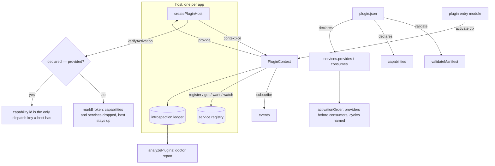

# api

[](https://www.npmjs.com/package/@intisy-ai/api)
[](https://www.npmjs.com/package/@intisy-ai/api)
[](https://github.com/intisy-ai/api/actions)

The plugin contract for the intisy-ai ecosystem, published as `@intisy-ai/api`. It holds the
`plugin.json` manifest schema, the capability interfaces a host consumes, the service registry
plugins talk to each other through, the plugin context and lifecycle, and the `validate` and
`doctor` commands. It has no dependencies and imports nothing from node outside its CLI, so a
host, a plugin, and a dashboard renderer can all import the same package.

## Under-the-Hood Architecture



## The permanence rules

The API is append-only from its first release. These four rules are what make that possible, and
they are enforced in review:

1. **The API package is append-only.** A published capability interface, service contract,
   manifest field, or event shape is never removed and never changes meaning. New needs get new
   ids, never edits to old ones. Deprecation is a documentation state, not a code change.
2. **Every vocabulary is open.** An unknown capability id, service id, event topic, manifest
   field, or screen-node kind is ignored with a debug log, never an error. A plugin built against
   next year's API loads on today's host, minus what the host does not know.
3. **`"api": 1` is a floor.** A host refuses to load only a plugin whose declared floor exceeds
   what the host implements, and says exactly that. Everything else loads.
4. **Nothing may branch on a plugin id.** Hosts and core libraries never compare against a
   specific plugin's id; capability ids and service ids are the only dispatch keys. A plugin
   asking for another plugin's namespaced service is not a violation: that is dispatch by service
   id, and declaring the dependency is the point.

## Structure

- `src/` (TypeScript source)
  - `manifest.ts`, `manifest-schema.ts`, `schema.ts`, `validate.ts`: the manifest and its validator
  - `capabilities.ts`, `capability-types.ts`, `ir.ts`: what a host consumes
  - `services.ts`, `events.ts`: what plugins consume from each other
  - `context.ts`, `plugin.ts`, `runtime.ts`: what a plugin receives and exports
  - `host.ts`, `ledger.ts`, `graph.ts`, `doctor.ts`: the host side
  - `cli/`: the only directory that imports node
- `dist/` (compiled output, not committed)
  - `index.js`: the importable surface, free of node imports
  - `cli/main.js`: the `intisy-plugin` command
- `schema/plugin.schema.json`: the manifest schema, emitted from `src/manifest-schema.ts`

## Installation

Through the plugin manager, as a dependency of the host or plugin that needs it:

```bash
npm install @intisy-ai/api
```

Inside this repo's own sibling packages, as a file dependency on the submodule checkout:

```json
{ "dependencies": { "api": "file:../api" } }
```

## Configuration

This package reads no configuration file. Its one environment switch is
`INTISY_PLUGIN_STRICT=1`, which makes every ignored unknown id loud instead of quiet:

```bash
INTISY_PLUGIN_STRICT=1 npx intisy-plugin doctor --home ~/.claude
```

A host can route the same diagnostics into its own logger with `setDiagnosticSink`, and force
the mode with `setStrict(true)`.

## Logging

This package writes no log files. Every plugin-facing message goes to the `Logger` the host puts
on the context, and the package's own diagnostics go to the sink a host installs, or to the
console when it installs none.

## License

MIT
